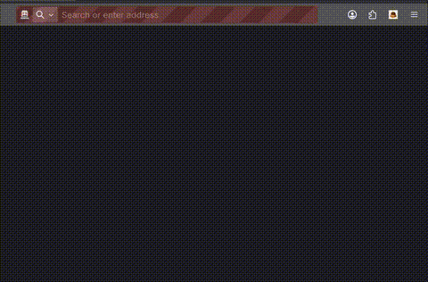

# Taskme — Quick summary

Taskme lets you turn short, natural-language task lines into Google Calendar events from a small popup.

Quick use

- Click the Taskme toolbar icon.
- If prompted, authorize with Google and allow calendar access.
- Type a task (e.g. "Lunch with Sam tomorrow 12pm"), press Enter.
- Review the preview and confirm to create the event.

Install (Firefox)

- Temporary load: open `about:debugging` → "This Firefox" → "Load Temporary Add-on" → choose this repo's `manifest.json`.
- Or for iterative dev: install `web-ext` (`npm i -g web-ext`) and run `web-ext run` from the project root.

Note: This is a draft app — expect rough edges and development-mode behavior.

Example usage:  

## Future Features

Provided the time, I would like to add these extra features:
- [ ] Add tasks as well as events.
- [ ] Support multiple calendars.
- [ ] Update events that already exist.
